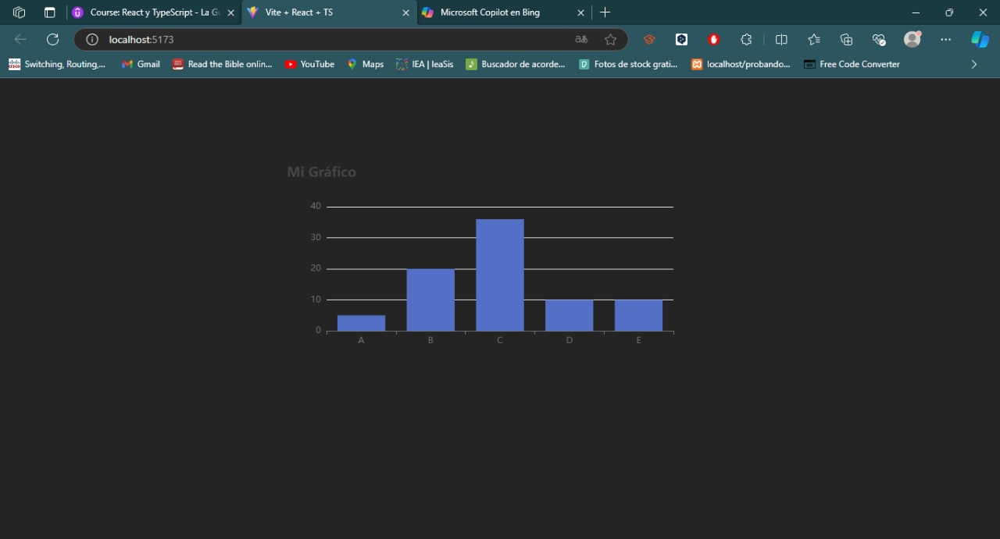
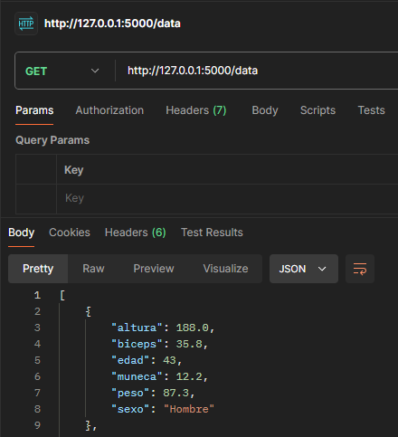
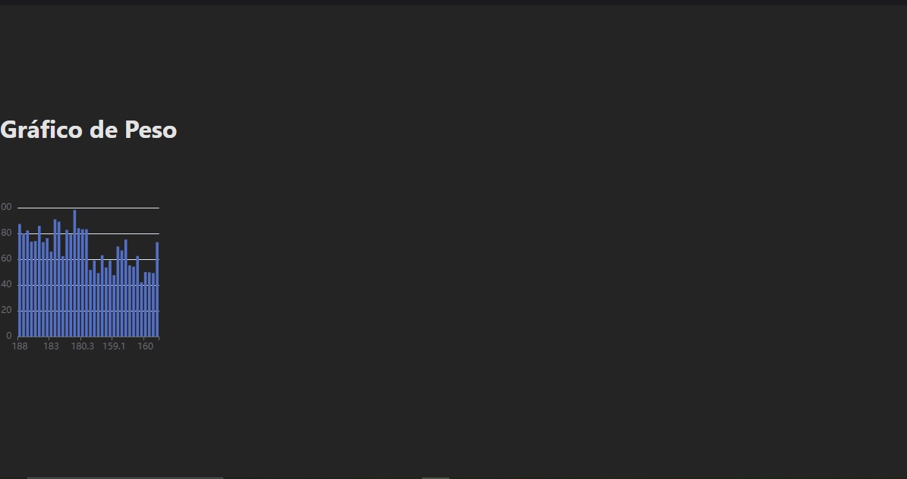
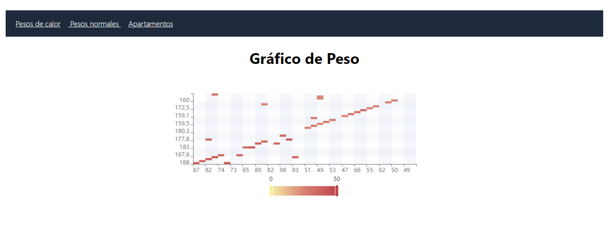

<h1>Reporte 1</h1>

<center>

## ¿Que es markdown?

</center>


Markdown es un lenguaje de marcado ligero, nos ayuda con la creacion de archivos que son legibles para el navegador, ademas este tiene una gran similitud con HTML, lo que hace que sea muy facil y sencillo de aprender, tambien soporta etiquetas de html lo que nos permite crear algunas estructuras que se usan en dicho lenguaje. 

<table>
    <thead>
        <tr>
            <td>una tabla</td>
            <td>hecha en Md</td>
        </tr>
    </thead>
    <tbody>
        <tr>
            <td>contenido</td>
            <td>contenido</td>
        </tr>
    </tbody> 
</table>

este lenguaje tiene muchas ventajas, se puede decir que una de ellas es la creacion de documentos para presisamente documentar, pues es muy sencillo poder hacerlo aqui, además tiene muchas ventajas. 

*Simplicidad.
*legibilidad.
*conversion a HTML

veamos algunos ejemplos

# Titulo
## Titulo
### Titulo
#### Titulo
##### Titulo
###### Titulo


1. Elemento 1
   1. Sub-elemento 1.1
   2. Sub-elemento 1.2
      1. Sub-sub-elemento 1.2.1
2. Elemento 2
   1. Sub-elemento 2.1

<p></p>

- Elemento 1
  - Sub-elemento 1.1
  - Sub-elemento 1.2
    - Sub-sub-elemento 1.2.1
- Elemento 2
  - Sub-elemento 2.1


<p></p>

1. Elemento 1
   - Sub-elemento 1.1
   - Sub-elemento 1.2
2. Elemento 2
   - Sub-elemento 2.1
     1. Sub-sub-elemento 2.1.1
     2. Sub-sub-elemento 2.1.2


ademas podemos poner fragmentos de codigo. 
```ts
const suma = (a, b):number => {
    return a + b;
}
```

y podemos hacer muchas cosas mas, pero no podriamos llenarlo todo en un solo documento... mas adelante veremos otras tecnicas para hacer más cosas. 


--------------------------------------------------------------

<center>

# Echarts

</center>


## ¿Qué es echarts? 

Echarts es una [libreria de Apache](https://echarts.apache.org/en/index.html) de código abierto que proporciona una gran cantidad de graficas, para una mejor visualizacion de datos, esta usa los lenguajes de programacion de JS y TS

[¿que es echart?](https://www.linkedin.com/pulse/por-que-apache-echarts-es-la-mejor-libreria-grafica-dario-bernabeu/)

una gran ventaja que tiene es que es de código abierto. Al ser de código abierto este es ampliamente usado por una gran cantidad de organizaciones la usan, por lo que hay mucha documentacion, y eso lo veremos mas adelante. 


----------------------------------------------------------------


<center>

# Ejemplo de graficacion React JS

</center>

## Crear proyecto en React JS

```JS
npm create vite@latest
```

nos pedirá que le demos el nombre del proyecto y despues nos pedira seleccionar alguna opcion para la creación del proyecto como TS / JS despues usaremos estos comandos

```JS
cd Proyecto
npm install
npm run dev
```

algo que tenemos que tomar en cuenta es que tenemos que instalar [echarts para react](https://www.npmjs.com/package/echarts-for-react)

```JS
npm install --save echarts-for-react
```

y para su uso...

```JS
import ReactECharts from 'echarts-for-react';
```

un ejemplo sencillo de la creacion de una grafica en React JS

```TS
import '../Config/Styles/index'
import ReactECharts from 'echarts-for-react';

const Graph = () => {

  const options = {
    title: {
      text: 'Mi Gráfico',
    },
    tooltip: {},
    xAxis: {
      data: ['A', 'B', 'C', 'D', 'E'],
    },
    yAxis: {},
    series: [
      {
        type: 'bar',
        data: [5, 20, 36, 10, 10],
      },
    ],
  };

  return (
    <div className='graph'>
      <ReactECharts option={options} className='graphstyle' />
    </div>
  )
}

export default Graph
```




-------


<center>

# graficacion con Python

</center>

para ello empezamos creando un ambiente virutal em Python. 
e instalamos lo necesario. 
```py
python -m venv env
python -m env ENV
cd ENV\Scripts\activate
pip install pandas
pip install pyecharts
```

haciendo uso de este [recurso](https://raw.githubusercontent.com/fhernanb/datos/master/medidas_cuerpo)


por lo que necesitamos servirnos de un backend para asi poder mandar el archivo a leer en este caso se usara Flask, por lo que veamos como se hace. 

```py
pip install flask
pip install Flask-Cors
```

y haciendo uso de la [documentacion](https://flask.palletsprojects.com/en/3.0.x/) de flask vemos es que es bastante sencillo empezar. 


```py
from flask import Flask

app = Flask(__name__)

@app.route("/")
def hello_world():
    return "<p>Hello, World!</p>"
```

para este proyecto se hizo de esta manera. 
 
```py
from flask import Flask, json, jsonify
from flask_cors import CORS

app = Flask(__name__)
CORS(app) 

@app.route("/")
def hello():
    return "Hello World!"

@app.route("/data", methods=["GET"])
def data():
    try:
        with open('src/datos.json') as json_file:
            data = json.load(json_file) 
        return jsonify(data)
    except FileNotFoundError:
        return jsonify({"error": "Archivo no encontrado"}), 404
    except json.JSONDecodeError:
        return jsonify({"error": "Error al decodificar el JSON"}), 500
if __name__ == "__main__":
    app.run(host="0.0.0.0", port=5000, debug=True)
```

para que este funcione lo corremos, y nos da las direccion para realizar las pruebas. 

<center>



</center>

una vez que corroboramos que funcione, nos pasamos a react. 

----

con una estructura de archivos especifica se hizo lo siguiente. 

- Assets
- Components
- Config
  - API
    - api.ts
  - Interfaces
    - interfaces.ts
  - Styles
    - Styles.css
- Views
  - vistas

haciendo uso de axios como herramienta para hacer peticiones, se hizó así.

```ts
npm install axios
```

y se creo el archivo Api.ts

```ts
import axios from 'axios'

export const Api = axios.create({
    baseURL: 'http://localhost:5000/'
});
```
pero antes se hizo una interfaz, con los datos del json obtenido. 

```ts
export interface DataInfo {
    edad:   number;
    peso:   number;
    altura: number;
    sexo:   Sexo;
    muneca: number;
    biceps: number;
}

export enum Sexo {
    Hombre = "Hombre",
    Mujer = "Mujer",
}

```

para poder usarlo en la petición que se hizó. 


```ts

    const [chartData, setChartData] = useState<DataInfo[]>([]);

    useEffect(() => {
        const fetchData = async () => {
            try {
                const response = await Api.get<DataInfo[]>('/data');
                setChartData(response.data);
            } catch (error) {
                console.error('Error fetching data:', error);
            }
        };

        fetchData();
    }, []);
```

para terminar así. 

```ts
//react
import { useState, useEffect } from "react";

//resources
import { DataInfo } from "../Config/interfaces/interface";
import {Api} from '../../src/Config/API/Api';

//libraries
import ReactECharts from 'echarts-for-react';

//Styles.
import '../Config/Styles/index'

const Weigth = () => {
    const [chartData, setChartData] = useState<DataInfo[]>([]);

    useEffect(() => {
        const fetchData = async () => {
            try {
                const response = await Api.get<DataInfo[]>('/data');
                setChartData(response.data);
            } catch (error) {
                console.error('Error fetching data:', error);
            }
        };

        fetchData();
    }, []);

    const getOption = () => {
        return {
            xAxis: {
                type: 'category',
                data: chartData.map(item => item.altura)
            },
            yAxis: {
                type: 'value'
            },
            series: [
                {
                    data: chartData.map(item => item.peso),
                    type: 'bar'
                }
            ]
        };
    };

    return (
        <div className='graph'>
            <h1>Gráfico de Peso</h1>
            <ReactECharts option={getOption()} className='graphstyle' />
        </div>
    );
};

export default Weigth;

```
por lo que ahora podemos mostrar los datos en react. 



---- 

Para poder mostrar mas de una sola grafica, se instaló, [React Router Dom](https://www.npmjs.com/package/react-router-dom)

por lo que los pasos a seguir primeramente fue instalarlo. 

```TS
npm i react-router-dom
```

Una vez hecho eso, se procedio a realizar el Router en react. 

```TS
import { BrowserRouter, Routes, Route } from 'react-router-dom'
import Layout from '../../layout/Layout'
import {Apartments, Graph, Weigth} from '../../Views/index'


const Router = () => {
    return (
        <BrowserRouter>
            <Routes>
                <Route element={<Layout />}>
                    <Route path='/' element={<Weigth />} index/>
                    <Route path='/Graph' element={<Graph />} />
                    <Route path='/Apartments' element={<Apartments />} />
                </Route>
            </Routes>
        </BrowserRouter>
    )
}

export default Router
```

y en el archivo Main ponemos el Router. 

```TS
import { StrictMode } from 'react'
import { createRoot } from 'react-dom/client'
import './Config/Styles/index.css'
import Router from './Config/Routes/Router'

createRoot(document.getElementById('root')!).render(
  <StrictMode>
    <Router/>
  </StrictMode>,
)
```
y se realizo un header para mostrarse en todas las Views. 

```TS
import "../Config/Styles/HeaderStyles.css"

export const Header = () => {
  return (
    <>
        <header className="header">
            <div className="containerPadre">
                <div className="container">
                    <nav>
                        <a href="/" className="text">Pesos de calor</a>
                        <a href="/Graph" className="text"> Pesos normales </a>
                        <a href="/Apartments" className="text"> Apartamentos </a>
                    </nav>
                </div>
            </div>
        </header>
    </>
  )
}
```
para ello se tiene que usar de Outlet para poder mostrarse en todos lados, tal como se muestra en el siguiente bloque de código. 

```TS
import { Outlet } from 'react-router-dom'
import { Header } from '../Components/Header'

export default function Layout() {
    return (
        <>
            <Header />
            <Outlet />
        </>
    )
}
```
para terminar viendose asi. 



----------

### Backend del proyecto

Backend del proyecto  [Github](https://github.com/lfuentes-xd/EchartsFlask)

### frontEnd del Proyecto.

FrontEnd del proyecto  [Github](https://github.com/lfuentes-xd/EchartFrontEnd)
