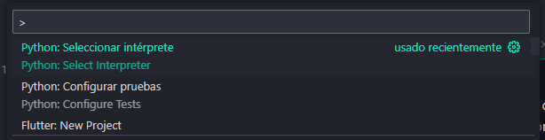
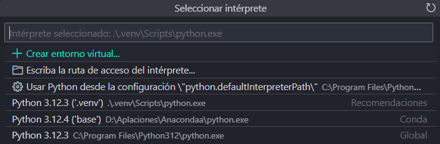

<center>

### Procesamiento de PDF´s con Python

</center>

---

<center>

### ¿De qué va este trabajo?

</center>

Este pequeño trabajo va acerca de la extraccion de informacion de unos documentos, que en este caso estaban en formato PDF, dentro de los cuales contenian distintos tipos de tablas, desde sencillas hasta otras mas complejas. todo esto con el uso de Python, para posteriormente guardarlas en un formato JSON y poder guardarlo posteriormente a ello.

veamos de que va este proyecto.

---

### Tipos de tablas.

#### Tablas de tipo Clave: valor

Esta en mi opinion era la mas sencilla de manejar puesto que solo se compone de dos columnas donde una es la clave y la otra es el valor; como el siguiente ejemplo.

<center>

<table>
    <thead>
        <tr>
            <td>Nombre del carro</td>
            <td>Nissan Altima 2.5 2018 advance</td>
        </tr>
        <tr>
            <td>Nombre de la transmision</td>
            <td>Transmision automatica CVT de 6 velocidades</td>
        </tr>
    </thead>
</table>
</center>

esa era la estrucutra de la tabla, al menos de la mas sencilla.


#### Tablas clave:valor con encabezados como columnas. 

estas son el siguiente nivel, por asi decirlo por que tenian una estrucutra como la siguiente. 


<center>

<table>
    <thead>
        <tr>
            <td>carros automaticos</td>
            <td>carros manuales</td>
        </tr>
    </thead>
    <tbody>
        <tr>
            <td>
                <li>
                    Nissan sentra
                </li>
                <li>
                    Nissan Tiida
                </li>
                <li>
                    Nissan altima
                </li>
                <li>
                    Nissan maxima
                </li>
            </td>
            <td>
                <li>
                    toyota corolla
                </li>
                <li>
                    toyota camty
                </li>
                <li>
                    toyota yaris
                </li>
                <li>
                    toyota prius
                </li>
            </td>
        </tr>
    </tbody>
</table>
</center>

#### Tablas columa-valor con mas de dos columnas y mas de dos filas. 

Para mi este fue de las mas complicadas de realizar por la complejidad que representan las mismas. 

<center>
<table>
    <thead>
        <tr>
            <td>Carros automáticos</td>
            <td>Carros manuales</td>
            <td>Cuántos km tiene</td>
            <td>Cuántos dueños ha tenido</td>
        </tr>
    </thead>
    <tbody>
        <tr>
            <td>Nissan Sentra</td>
            <td>Toyota Corolla</td>
            <td>80,000 km</td>
            <td>1</td>
        </tr>
        <tr>
            <td>Honda Civic</td>
            <td>Ford Fiesta</td>
            <td>120,000 km</td>
            <td>2</td>
        </tr>
        <tr>
            <td>Chevrolet Cruze</td>
            <td>Volkswagen Jetta</td>
            <td>95,000 km</td>
            <td>3</td>
        </tr>
    </tbody>
</table>
</center>


#### tablas con formas especuales. 

estas tablas fueran sencillas y a la par complicadas, puesto que tenian una forma irregular, ya que los encabezados no siempre coincidian...

<center>

<table border="1" cellspacing="0" cellpadding="5">
    <thead>
        <tr>
            <th rowspan="2">Carros</th>
            <th colspan="3">en constrccion</th>
        </tr>
        <tr>
            <th>Total</th>
            <th>Nuevos</th>
            <th>en construccion</th>
        </tr>
    </thead>
    <tbody>
        <tr>
            <td>Nissan sentra</td>
            <td>8</td>
            <td>6</td>
            <td>2</td>
        </tr>
    </tbody>
</table>

</center>

que aunque se veia complicado resulto no serlo del todo. 


----

<center>

### Retos al hacer este script 

</center>


de los primeros retos que se enfrento fue el hecho de que al momento de extraer la informacion de los pdf venia con datos tal como...

1. None
2. ''
3. \n
4. sibolos o caracteres especiales

por lo que era importante empezar con la limpieza de las tablas en un primer lugar. pero para ello necesitamos la importacion de la libreria.


----

<center> 

#### Creacion del Script

</center>


##### Paso 1. Importacion de las librerias / creacion del entorno virtual...

```Py
# para la creacion del entorno virtual
python -m venv .venv

# para la activacion del mismo 
.venv\Scripts\activate
```


>[!TIP]
>si se esta usando un editor como Vscode podemos hacer la conbinacion de teclas. CTRL + SHIFT + P para que nos salga una barra y en ella podamos escribir Python:Selccionar Interprete, donde selccionamores nuestro venv para que cada vez que habramos una nueva terminal se ejecute dentro del ambiente virtual y no haya problemas futuros. 

<center >



</center>


<center >



</center>

posterior a ello, necesitamos instalar lo necesario para poder empezar...

```Py
pip install os
pip install pdfplumber
```

lo primero que neceaitamos hacer es importar dichas librerias. 

```Py
import json
import pdfplumber
import os
```

#### Paso 2. creacion de la funcion primcipal para la lectura de los archivos. 

```Py
def extract_tables_from_pdf(pdf_file):
    tables_data = []
    with pdfplumber.open(pdf_file) as pdf:
        for page_number, page in enumerate(pdf.pages, start=1):
            print(f"Procesando página {page_number}...")
            tables = page.extract_tables()
            
            for table in tables:
                if table:
                    print(f"Tabla detectada:", table)
                    # Limpia la tabla
                    cleaned_table = clean_and_combine_table(table)
                    print(f"Tabla limpia:", cleaned_table)
                    
                    # Identificar el tipo de tabla
                    table_type = table_clasification(cleaned_table)
                    print(f"Tipo de tabla identificada: {table_type}")
                    
                    # Procesar según el tipo de tabla
                    if table_type == "Columna-Valores-1-fila":
                        tables_data.append(process_columna_valores_1_fila(cleaned_table))
                    elif table_type == "Columna-Valores-varias-filas":
                        tables_data.append(process_columna_valores_varias_filas(cleaned_table))
                    elif table_type == "Clave-Valor":
                        tables_data.append(process_clave_valor(cleaned_table))
                    elif table_type == "Mas-de-dos-columnas":
                        tables_data.append(process_mas_de_dos_columnas(cleaned_table))
                    elif table_type == "especial":
                        tables_data.append(especial(cleaned_table))
                    else:
                        print(f"Tipo de tabla desconocido o no soportado: {table_type}")
    
    return tables_data
    

pdf_directory = 'D:/Descargas/Archivo/Programa anual de investigación 2020.pdf'    
json_output = []

tables = extract_tables_from_pdf(pdf_directory)
json_output.extend(tables)

with open('output.json', 'w', encoding='utf-8') as json_file:
    json.dump(json_output, json_file, ensure_ascii=False, indent=4)

print("El archivo JSON con las tablas se ha generado correctamente.")
```

Es necesario explicar el codigo...

Esta parte es para la lectura de los archivos. 
donde le damos la ruta, y guardamos el resultado en un archivo de tipo Json

```Py

pdf_directory = 'D:/Descargas/Archivo/Programa anual de investigación 2020.pdf'    
json_output = []

tables = extract_tables_from_pdf(pdf_directory)
json_output.extend(tables)

with open('output.json', 'w', encoding='utf-8') as json_file:
    json.dump(json_output, json_file, ensure_ascii=False, indent=4)

print("El archivo JSON con las tablas se ha generado correctamente.")
```

Como se puede observar aqui se hace uso de la libreria antes mencionada y de otros  metodos que veremos mas adelante. 

```Py
def extract_tables_from_pdf(pdf_file):
    tables_data = []
    with pdfplumber.open(pdf_file) as pdf:
        for page_number, page in enumerate(pdf.pages, start=1):
            print(f"Procesando página {page_number}...")
            tables = page.extract_tables()
            
            for table in tables:
                if table:
                    print(f"Tabla detectada:", table)
                    # Limpia la tabla
                    cleaned_table = clean_and_combine_table(table)
                    print(f"Tabla limpia:", cleaned_table)
                    
                    # Identificar el tipo de tabla
                    table_type = table_clasification(cleaned_table)
                    print(f"Tipo de tabla identificada: {table_type}")
                    
                    # Procesar según el tipo de tabla
                    if table_type == "Columna-Valores-1-fila":
                        tables_data.append(process_columna_valores_1_fila(cleaned_table))
                    elif table_type == "Columna-Valores-varias-filas":
                        tables_data.append(process_columna_valores_varias_filas(cleaned_table))
                    elif table_type == "Clave-Valor":
                        tables_data.append(process_clave_valor(cleaned_table))
                    elif table_type == "Mas-de-dos-columnas":
                        tables_data.append(process_mas_de_dos_columnas(cleaned_table))
                    elif table_type == "especial":
                        tables_data.append(especial(cleaned_table))
                    else:
                        print(f"Tipo de tabla desconocido o no soportado: {table_type}")
    
    return tables_data
```

empecemos entonces por esta parte...

aqui con el uso de la libreria extraeremos la infromacion de las tablas que haya dentro del PDF

si encontramos una tabla empezamos con su procesamiento. 

```Py 
with pdfplumber.open(pdf_file) as pdf:
        for page_number, page in enumerate(pdf.pages, start=1):
            print(f"Procesando página {page_number}...")
            tables = page.extract_tables()
            
            for table in tables:
                if table:
                    
```

en esta linea llamamos al primer metodo que necesitamos...
pues cuando se extrae la informacion esta no biene del todo bien... 
```PY
cleaned_table = clean_and_combine_table(table)
```

#### Creacion de metodos necesarios para el procesamiento de datos...

Este es el metodo usado para la limpieza de los datos extraidos para quitar ....

1. Espacios en blanco
2. Saltos de linea
3. datos no reconocidos (como None)

Este metodo nos retorna la tabla con el mismo formato pero sin lo anteriormente mencionado. 
```Py

def clean_and_combine_table(table):
    cleaned_table = []
    
    for row in table:
        cleaned_row = []
        combined_cell = ""
        
        for cell in row:
            if cell:
                cleaned_cell = cell.strip().replace('\n', ' ')
                if combined_cell:  # Si ya hay contenido combinado
                    combined_cell += " " + cleaned_cell
                else:
                    combined_cell = cleaned_cell
            else:
                combined_cell = ""  # Reinicia si encuentras una celda vacía

            if combined_cell:
                cleaned_row.append(combined_cell)
                combined_cell = ""  # Reinicia para la siguiente celda
        
        if cleaned_row:
            cleaned_table.append(cleaned_row)
    
    return cleaned_table
```

una vez que el metodo nos retorna la tabla limpia sigue el sigueinte paso...
que es en que tipo de tabla encaja...
```Py
table_type = table_clasification(cleaned_table)
print(f"Tipo de tabla identificada: {table_type}")
```

Tipos de tablas...

Recordemos que hay muchos tipos de tablas...
y en este metodo se clasifican

> [!CAUTION]
> Este metodo fue hecho especificamente para las tablas encontradas en los distontos archivos proporcionados por lo que puede haber inconsistencias con otros tipos de tablas no analisadas

```Py

def table_clasification(table):
    keywords = ["Total", "Nuevos", "Continúan"]
    num_columns = sum(1 for cell in table[0] if cell and cell.strip()) if len(table) > 0 else 0
    num_rows = len(table)

    print(f"Número de columnas: {num_columns}")
    print(f"Número de filas: {num_rows}")

    # Verificar si la tabla tiene al menos 2 filas antes de intentar acceder a la segunda fila
    if num_rows >= 2:
        if any(keyword in (cell or "") for keyword in keywords for cell in table[1]):
            return "especial"
    
    if num_columns == 2:
        if num_rows == 2:
            return "Columna-Valores-1-fila"
        else:
            first_row = table[0] if len(table) > 0 else []
            print(f"Contenido de la primera fila: {first_row}")

            if len(first_row) > 0 and first_row[0] and len(first_row[0].strip()) > 10:  
                return "Clave-Valor"
            elif len(first_row) > 1 and len(first_row[1].strip()) > 10:
                return "Clave-Valor"
            else:
                return "Columna-Valores-varias-filas"
    elif num_columns > 2:
        return "Mas-de-dos-columnas"
    elif num_columns == 1:
            return "Clave-Valor"
    
    return "Desconocido"
```

con el resultado de la tabla podemos empezar a convertir los distintos datos en formato deseado dependiendo el tipo de tabla...
a modo de Switch Case se uso la siguiente estructura..

```Py 
                    if table_type == "Columna-Valores-1-fila":
                        tables_data.append(process_columna_valores_1_fila(cleaned_table))
                    elif table_type == "Columna-Valores-varias-filas":
                        tables_data.append(process_columna_valores_varias_filas(cleaned_table))
                    elif table_type == "Clave-Valor":
                        tables_data.append(process_clave_valor(cleaned_table))
                    elif table_type == "Mas-de-dos-columnas":
                        tables_data.append(process_mas_de_dos_columnas(cleaned_table))
                    elif table_type == "especial":
                        tables_data.append(especial(cleaned_table))
                    else:
                        print(f"Tipo de tabla desconocido o no soportado: {table_type}")
```

#### metodos para la conversion de tablas.

empecemos con el primer tipo de tabla y su metodo...

Este es el mas sencillo de todos por la estrucutra sencilla que esta tiene....

```Py

def process_columna_valores_1_fila(table):
    """Procesa una tabla de tipo Columna-Valores (con solo una fila)."""
    key = table[0][0].strip()
    value = table[1][0].strip()
    key2 = table[0][1].strip()
    value2 = table[1][1].strip()
    return {key: value, key2: value2}
```

El segundo metodo es ...
para cuando tiene  dos columnas pero con muchas filas... 

```Py

def process_columna_valores_varias_filas(table):
    """Procesa una tabla de tipo Columna-Valores (con varias filas)."""
    result = {}
    for row in table:
        # Asegúrate de manejar el caso donde la celda puede ser None
        key = row[0].strip() if row[0] else ''  # Asigna una cadena vacía si es None
        value = row[1].strip() if row[1] else ''  # Asigna una cadena vacía si es None
        result[key] = value
    return result
```

La siguiente son las tablas tipo Clave:valor
que tambien son de las sencillas. 

```Py

def process_clave_valor(table):
    """Procesa una tabla de tipo Clave-Valor."""
    result = {}
    for row in table:
        if len(row) < 2:  # Verifica que hay al menos dos elementos
            continue  # Salta la fila si no tiene suficientes elementos

        key = row[0].strip() if row[0] else ''  # Asigna cadena vacía si es None
        value = row[1].strip() if len(row) > 1 and row[1] else ''  # Verifica el índice y asigna cadena vacía si es None
        
        if key:  # Solo agrega si la clave no está vacía
            result[key] = value
    
    return result
```

la siguiente es cuando hay mas de dos columnas...

```Py

def process_mas_de_dos_columnas(table):
    """Procesa una tabla con más de dos columnas."""
    result = []
    for row in table:
        cleaned_row = [cell.strip() if cell else '' for cell in row]
        result.append(cleaned_row)
    return result
```

y por ultimo las que tienen una forma especial pues no se parece a una tabla de las anteriores. 

```Py

def especial(table):
    """Procesa una tabla especial."""
    result = []
    
    result.append(table[0])  
    print(f"Primera fila: {table[0]}")
    
    headers = [header.strip() for header in table[1] if header]
    result.append(headers)  
    print(f"Encabezados: {headers}")
    
    for row in table[2:]:
        print(f"Fila original: {row}")

        key = row[0].strip() if row[0] else ""
        values = [cell.strip() for cell in row[1:]]  
        result.append({key: values})

    print(f"Resultado final de especial: {result}")
    return result
```

----

<center>

### Código completo

</center>

```Py
import json
import pdfplumber
import os

def clean_and_combine_table(table):
    cleaned_table = []
    
    for row in table:
        cleaned_row = []
        combined_cell = ""
        
        for cell in row:
            if cell:
                cleaned_cell = cell.strip().replace('\n', ' ')
                if combined_cell:  # Si ya hay contenido combinado
                    combined_cell += " " + cleaned_cell
                else:
                    combined_cell = cleaned_cell
            else:
                combined_cell = ""  # Reinicia si encuentras una celda vacía

            if combined_cell:
                cleaned_row.append(combined_cell)
                combined_cell = ""  # Reinicia para la siguiente celda
        
        if cleaned_row:
            cleaned_table.append(cleaned_row)
    
    return cleaned_table

def table_clasification(table):
    keywords = ["Total", "Nuevos", "Continúan"]
    num_columns = sum(1 for cell in table[0] if cell and cell.strip()) if len(table) > 0 else 0
    num_rows = len(table)

    print(f"Número de columnas: {num_columns}")
    print(f"Número de filas: {num_rows}")

    # Verificar si la tabla tiene al menos 2 filas antes de intentar acceder a la segunda fila
    if num_rows >= 2:
        if any(keyword in (cell or "") for keyword in keywords for cell in table[1]):
            return "especial"
    
    if num_columns == 2:
        if num_rows == 2:
            return "Columna-Valores-1-fila"
        else:
            first_row = table[0] if len(table) > 0 else []
            print(f"Contenido de la primera fila: {first_row}")

            if len(first_row) > 0 and first_row[0] and len(first_row[0].strip()) > 10:  
                return "Clave-Valor"
            elif len(first_row) > 1 and len(first_row[1].strip()) > 10:
                return "Clave-Valor"
            else:
                return "Columna-Valores-varias-filas"
    elif num_columns > 2:
        return "Mas-de-dos-columnas"
    elif num_columns == 1:
            return "Clave-Valor"
    
    return "Desconocido"


def especial(table):
    """Procesa una tabla especial."""
    result = []
    
    result.append(table[0])  
    print(f"Primera fila: {table[0]}")
    
    headers = [header.strip() for header in table[1] if header]
    result.append(headers)  
    print(f"Encabezados: {headers}")
    
    for row in table[2:]:
        print(f"Fila original: {row}")

        key = row[0].strip() if row[0] else ""
        values = [cell.strip() for cell in row[1:]]  
        result.append({key: values})

    print(f"Resultado final de especial: {result}")
    return result

def process_columna_valores_1_fila(table):
    """Procesa una tabla de tipo Columna-Valores (con solo una fila)."""
    key = table[0][0].strip()
    value = table[1][0].strip()
    key2 = table[0][1].strip()
    value2 = table[1][1].strip()
    return {key: value, key2: value2}

def process_columna_valores_varias_filas(table):
    """Procesa una tabla de tipo Columna-Valores (con varias filas)."""
    result = {}
    for row in table:
        # Asegúrate de manejar el caso donde la celda puede ser None
        key = row[0].strip() if row[0] else ''  # Asigna una cadena vacía si es None
        value = row[1].strip() if row[1] else ''  # Asigna una cadena vacía si es None
        result[key] = value
    return result

def process_clave_valor(table):
    """Procesa una tabla de tipo Clave-Valor."""
    result = {}
    for row in table:
        if len(row) < 2:  # Verifica que hay al menos dos elementos
            continue  # Salta la fila si no tiene suficientes elementos

        key = row[0].strip() if row[0] else ''  # Asigna cadena vacía si es None
        value = row[1].strip() if len(row) > 1 and row[1] else ''  # Verifica el índice y asigna cadena vacía si es None
        
        if key:  # Solo agrega si la clave no está vacía
            result[key] = value
    
    return result

def process_mas_de_dos_columnas(table):
    """Procesa una tabla con más de dos columnas."""
    result = []
    for row in table:
        cleaned_row = [cell.strip() if cell else '' for cell in row]
        result.append(cleaned_row)
    return result


def extract_tables_from_pdf(pdf_file):
    tables_data = []
    with pdfplumber.open(pdf_file) as pdf:
        for page_number, page in enumerate(pdf.pages, start=1):
            print(f"Procesando página {page_number}...")
            tables = page.extract_tables()
            
            for table in tables:
                if table:
                    print(f"Tabla detectada:", table)
                    # Limpia la tabla
                    cleaned_table = clean_and_combine_table(table)
                    print(f"Tabla limpia:", cleaned_table)
                    
                    # Identificar el tipo de tabla
                    table_type = table_clasification(cleaned_table)
                    print(f"Tipo de tabla identificada: {table_type}")
                    
                    # Procesar según el tipo de tabla
                    if table_type == "Columna-Valores-1-fila":
                        tables_data.append(process_columna_valores_1_fila(cleaned_table))
                    elif table_type == "Columna-Valores-varias-filas":
                        tables_data.append(process_columna_valores_varias_filas(cleaned_table))
                    elif table_type == "Clave-Valor":
                        tables_data.append(process_clave_valor(cleaned_table))
                    elif table_type == "Mas-de-dos-columnas":
                        tables_data.append(process_mas_de_dos_columnas(cleaned_table))
                    elif table_type == "especial":
                        tables_data.append(especial(cleaned_table))
                    else:
                        print(f"Tipo de tabla desconocido o no soportado: {table_type}")
    
    return tables_data

pdf_directory = '**su ruta aqui **'    
json_output = []

tables = extract_tables_from_pdf(pdf_directory)
json_output.extend(tables)

with open('output.json', 'w', encoding='utf-8') as json_file:
    json.dump(json_output, json_file, ensure_ascii=False, indent=4)

print("El archivo JSON con las tablas se ha generado correctamente.")

```


> [!CAUTION]
> importante a consierar que el codigo anterior solo corre un archivo a la vez, para ello es importante cambiar 
> la parte de la direccion del pdf como se muestra el siguiente codigo. 


con el siguiente fragmento de codigo hacemos que se lean una cantidad N de pdf. 

```Py

def extract_tables_from_pdf(pdf_file):
    tables_data = []
    with pdfplumber.open(pdf_file) as pdf:
        for page_number, page in enumerate(pdf.pages, start=1):
            print(f"Procesando página {page_number} en {pdf_file}...")
            tables = page.extract_tables()
            
            for table in tables:
                if table:
                    print(f"Tabla detectada:", table)
                    # Limpia la tabla
                    cleaned_table = clean_and_combine_table(table)
                    print(f"Tabla limpia:", cleaned_table)
                    
                    # Identificar el tipo de tabla
                    table_type = table_clasification(cleaned_table)
                    print(f"Tipo de tabla identificada: {table_type}")
                    
                    # Procesar según el tipo de tabla
                    if table_type == "Columna-Valores-1-fila":
                        tables_data.append(process_columna_valores_1_fila(cleaned_table))
                    elif table_type == "Columna-Valores-varias-filas":
                        tables_data.append(process_columna_valores_varias_filas(cleaned_table))
                    elif table_type == "Clave-Valor":
                        tables_data.append(process_clave_valor(cleaned_table))
                    elif table_type == "Mas-de-dos-columnas":
                        tables_data.append(process_mas_de_dos_columnas(cleaned_table))
                    elif table_type == "especial":
                        tables_data.append(especial(cleaned_table))
                    else:
                        print(f"Tipo de tabla desconocido o no soportado: {table_type}")
    
    return tables_data

def extract_tables_from_pdfs_in_directory(pdf_directory):
    json_output = []

    for filename in os.listdir(pdf_directory):
        if filename.endswith(".pdf"):
            pdf_file_path = os.path.join(pdf_directory, filename)
            tables = extract_tables_from_pdf(pdf_file_path)
            json_output.extend(tables)

    with open('output.json', 'w', encoding='utf-8') as json_file:
        json.dump(json_output, json_file, ensure_ascii=False, indent=4)

    print("El archivo JSON con las tablas se ha generado correctamente.")

# Ruta de la carpeta con los archivos PDF
pdf_directory = '**su ruta aqui**'  
extract_tables_from_pdfs_in_directory(pdf_directory)
```