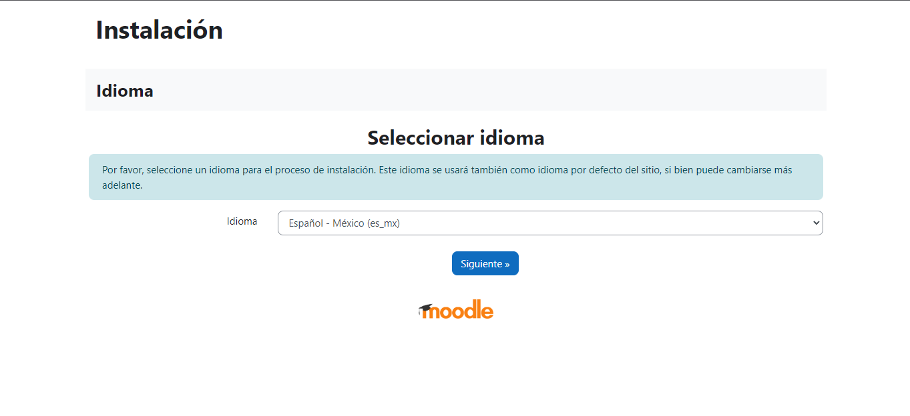
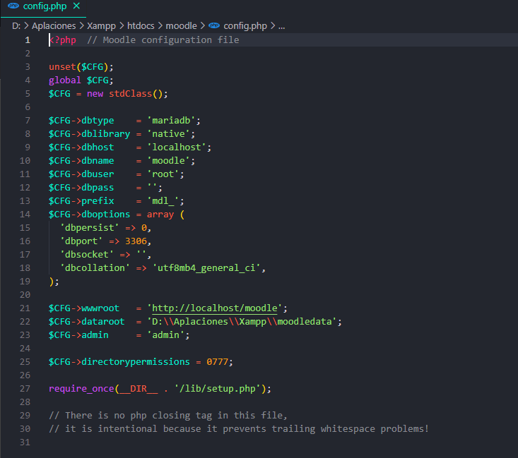
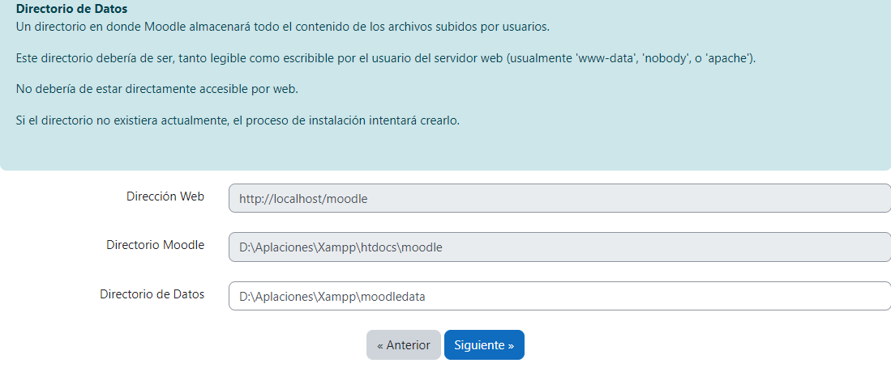
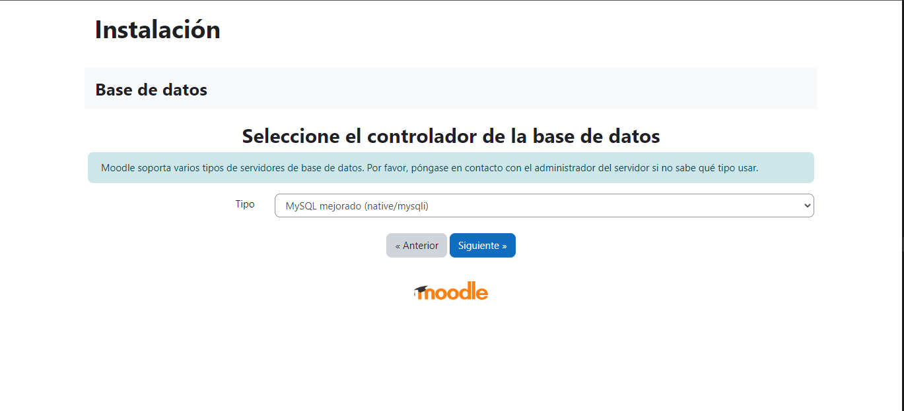
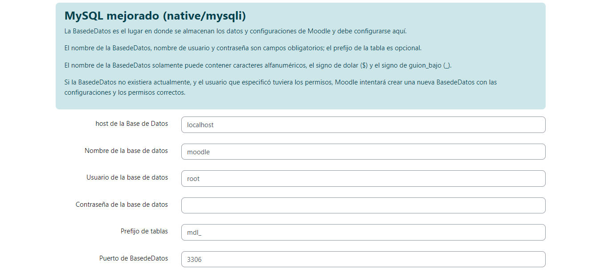
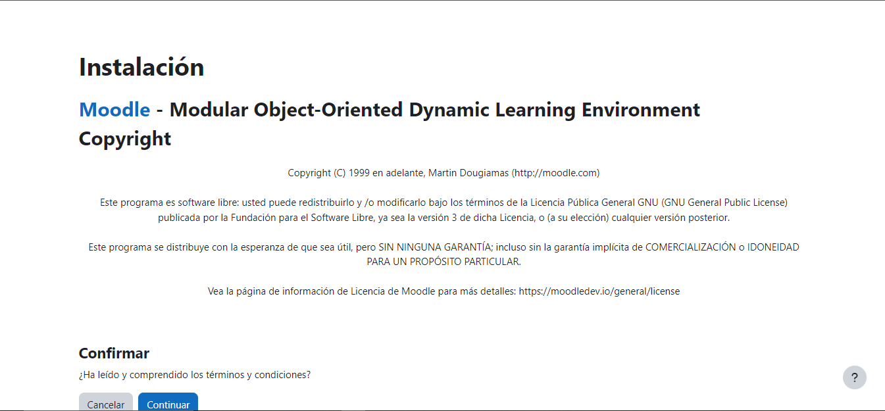
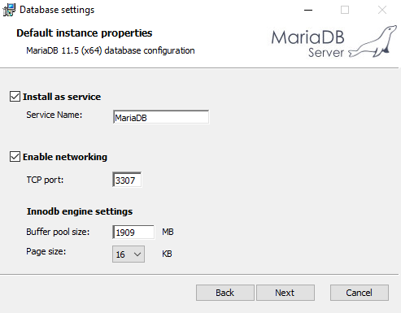
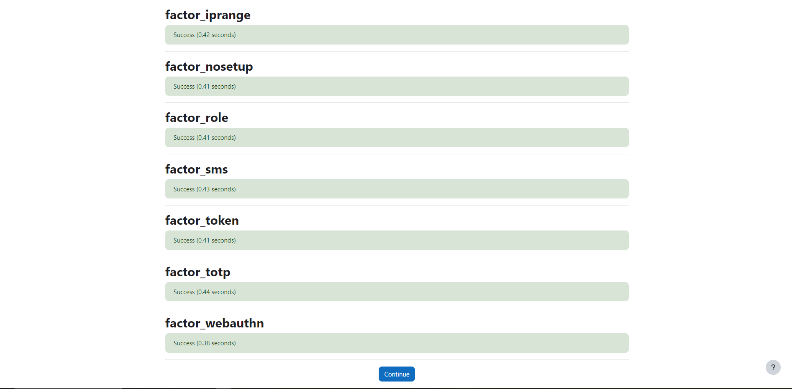
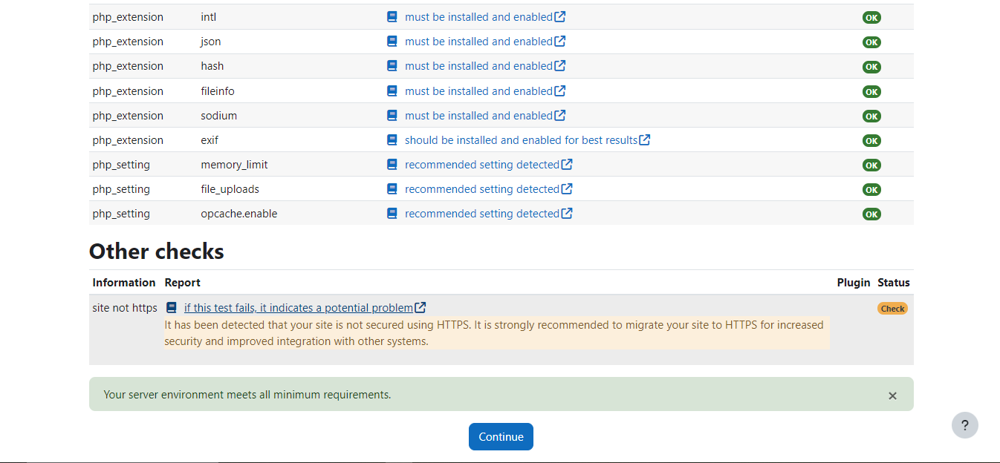

<center>

# Reporte de instalación Moodle 

</center>

---

## ¿Qué es moodle? 

Moodle es una plataforma para la enseñanza en línea que es sumamente útil, ya que es sencilla de aprender a usar. No solo eso, sino que también es de código abierto, lo que la hace ampliamente utilizada en todo el mundo. Además, su fácil instalación, que utiliza servicios como PHP y XAMPP, herramientas muy populares, aumenta su facilidad de uso.

## ¿Cómo se instala? 

Para ello, necesitamos dirigirnos a la página oficial de Moodle y descargar la versión que más nos convenga. En este caso, se instaló la versión 4.5. Ahora, veamos los materiales utilizados para la instalación de esta herramienta.
[Link de descarga de moodle](https://download.moodle.org/releases/latest/)

### Herramientas. 

- Laptop
  - AMD Ryzen 5 2500 u
  - Tarjeta grafica AMD Radeon 8 Vega
  - 16 Gb ram
  - 1 TB SSF
- Servidor XAMPP
- PHP version 8.2 o superior
- MariaDB 

Con lo anterior es posible comnezar a instalar la plataforma de aprendizaje Moodle. 

### Paso 1. 
Descargar moodle de su página oficial. 
[Link de descarga de Moodle](https://download.moodle.org/releases/latest/)
### Paso 2. 

Necesitamos ubicar donde se instaló la aplicacion de Xampp (sino lo tiene descargado dirijase a este link [Link de descarga de Xampp](https://www.apachefriends.org/es/download_success.html)) (oh algun otro servidor como CPANEL oh WAMPP), en mi caso la ruta es la siguiente: 

```cmd
D:/Aplicaciones/Xampp
```

### Paso 3. 

dentro de la carpeta de Xampp necesitamos crear una carpeta para Moodle.  llamadada: **moodledata** 


```cmd
D:\Aplaciones\Xampp\htdocs\moodledata
```
> [!CAUTION]
> Es indispensable crear esta carpeta no lo pase por alto. 

Esta carpeta es fundamental en el funcionamiento del sistema, ya que en ella se almacena una gran variedad de datos importantes para el software.


### Paso 4. 
El archivo de moodle cuando se descarga, esta comprimido, por lo que lo descomprimimos y lo pegamos en la carptea de xampp, dentro de **htdocs**

```cmd
D:\Aplaciones\Xampp\htdocs\moodle
```

Una vez hecho lo anteior corremos el servidor xampp ( oh  el que usted use )
Y posterior a ello abrimos algun navegador web y ponemos la siguiente ruta en la barra superior: 

```cmd
localhost/moodle
```

y procedemos con la instalación del software. 



### Paso 5. 

La instalación del sfotware es relativamente sencilla, pues es una interfáz grafica sumamente amigable, la parte compleja de la instalacion es la configuración extra que tengamos que hacer en caso de que nuestro MariaDB este desactualizado (que fue mi caso)

pero para comenzar necesitamos modificar el archivo config.php 


> [!CAUTION]
> Tenga cuidado, no modifique el archivo config.php del servidor que use, el que tiene que modificar es el archivo de moodle. 



y este generalmente se encuentra en la siguiente ruta: 

```cmd
D:\Xampp\htdocs\moodle\config.php
```
Esto para poner los datos para que el software pueda empezar con el proceso de instalación. 

En mi caso me todo instalar MariaDB y correrlo en otro puerto diferente al de Xampp (puesto que este servidor no tiene una versión compatible)


### Paos 6. Verificación de las rutas.

Como ya se mencionó unos pasos atras, la instalación es muy sencilla pues es una interfaz agradable y facil de usar, verifique que las rutas que le aparecen sean correctas, en caso de ser asi, proceda normalmente con la instalación del software.




### Paso 7. Seleccione el controlador para la base de datos. 

Seleccione el controlador que en este caso usted usará, en el caso propio se uso MySQL.


### Paso 8. Llenado de credenciales para la base de datos. 
El archivo de config.php se podría decir que se genera automaticamente en base a lo que pongamos dentro de los campos como se muestra en la siguiente imagen. 



### Paso 9. Aceptamos los terminos y condiciones. 



<center>

### Instalación de MariaDB

</center>
En caso de que su servidor no sea compatible con la versión de mariaDB que use por defecto, tendra que descarhar e instalar mariaDB para el correcto funcionamiento de Moodle
MariaDB al usar un instalador .msi es bastante sencillo de instalar pues no requiere de configuración extra (amenos que le ponga contraseña que sería la única difernecia que hay respecto a mi instalación)




Una vez que se haya instalado necesitamos crear la base de datos que usara Moodle tal cual como se ve en la imagen. 

para crear la base de datos se ocupa el siguiente comando: 

```SQL
CREATE DATABASE moodle
```

y para verificar que si se creo, usamos el comando: 

```SQL
SHOW DATABASES; 
```


### Paso 10. Generación de credenciales para acceder. 

En el siguiente paso le saldra una ventana dónde tendrá que poner credenciales como:

- Username.
- Password.
- Nombre.
- Apellidos.
- Dirección de correo.
- País.
- Y el uso horario. 

Una vez hechó lo anterior omnezará la instalación: 


### TroubleShooting

Puede que una vez empesado el proceso de instalacion nos de algunos errores, más allá de MariaDB (que fue mi caso) la mayor parte de la configuración adicional que tendra que realizar sera en el archivo php.ini de XAMPP (oh del servidor que use)
En esta pantalla nos saldrán los errores que tenemos que corregir. 



### Paso final: disfute de su moodle

